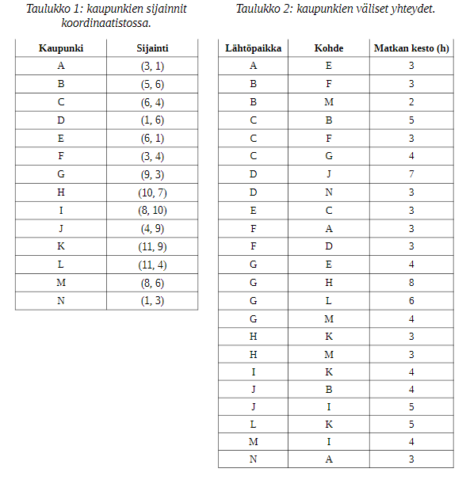

------------------------------------------------------------------------------------------

# TEHTÄVÄT

------------------------------------------------------------------------------------------

## Edsger Tähti, max 15 XP

###  Kaupungit   A–N   sijaitsevat   taulukon   1   koordinaattien   esittämissä   paikoissa   (tavanomaisessa euklidisessa kaksiulotteisessa koordinaatistossa). Niistä pääsee kulkemaan yksisuuntaisia teitäpitkin   toisiinsa   taulukon   2   esittämällä   tavalla.   Muuten   liikkuminen   kaupunkien   välillä   onmahdotonta. 



#### a) Agenttisi tahtoo päästä mahdollisimman nopeasti kaupungista A kaupunkiin K ja käyttää Dijkstran algoritmia (uniform cost search) löytääkseen optimaalisen reitin. Mikä on tuo löytyvä reitti? Kuinka kauan matka tulee kestämään?

#### b) Kuten a), mutta käytä A*-algoritmia käyttäen heuristiikkana suoraa linnuntie-etäisyyttä maaliin. 

#### c) Löytyykö tieverkoston suunnittelusta jotain huomautettavaa?

a) A -> E -> C -> G -> H -> K. Matka kestää 21 tuntia.
b) A -> E -> C -> B -> M -> I -> K. Matka kestää 21 tuntia.
c) Ainakin K-solmu on sellainen, että jos siihen solmuun päätyy, niin sieltä ei pääse enää pois, koska verkoston "tiet" ovat yksisuuntaisia ja kaikki "tiet" vain vievät K:hon, mutta ei pois sieltä.

------------------------------------------------------------------------------------------

## Lo’Og Inen, max 15 XP

### Tutustu   Prolog-kieleen.   Implementaatioista   suosittuja   ovat   esim.   GNU   Prolog(http://www.gprolog.org/) ja SWI-Prolog (https://www.swi-prolog.org/). Tarkastellaan seuraavaa tietämyskannan määrittelyä.

```
fish(_).
dog(odie).
cat(garfield).
human(liz).
human(jon).
animal(X) :- cat(X); dog(X); human(X); fish(X).
tail_color(garfield, orange).
tail_color(odie, black).
has_tail(X) :- tail_color(X,_).
has_tail(unix).
first_likes_second(odie, garfield).
first_likes_second(jon, garfield).
first_likes_second(jon, odie).
first_likes_second(jon, liz).
first_likes_second(jon, fish).
```

#### Miten esität nämä kysymykset Prolog-kyselyinä (käyttäen nimeämisestä pääteltävissä olevaa semantiikkaa)?

- Mistä ihmisistä, kissoista tai mustahäntäisistä Jonin tiedetään pitävän?
- Millä eläimillä ei tiedetä olevan häntää?
- Tiedetäänkö Jonin pitävän jostakin tai jostakusta, joka pitää jostain hännällisestä, joka ei ole eläin?

1 first_likes_second(jon, X), human(X); cat(X); tail_color(X, black).
2 animal(X), \+ (has_tail(X)).
3 first_likes_second(jon, X), first_likes_second(X, Y), \+ (animal(Y)), has_tail(Y).

------------------------------------------------------------------------------------------

## Puh’Uva Inen, max 30 XP

### Valmistele   10   minuutin   esitys   jostakin   valmiista   (kaupallisesta   tai   ei-kaupallisesta)tuotteesta/kielestä/ohjelmasta/ohjelmistosta/kirjastosta/(pilvi)ympäristöstä, joka liittyy oleellisestitekoälyn   (johonkin   sen   osa-alueen)   toteuttamiseen   ja   johon   olisi   hyödyllistä/mielenkiintoistatutustua, ellei aihetta vielä tunne. Kirjaa tähän aihe. Jotta tästä tehtävästä voi saada pisteitä, tuleeesitys pyydettäessä pitää viidennen AI-session  (12.2.)  aikana. (Aikaa siis valmistella esitys onparisen viikkoa, mutta aihe pitää rekisteröidä normaaliaikataulun mukaisesti noin viikossa.)

*VASTAUS*

------------------------------------------------------------------------------------------